<!DOCTYPE html PUBLIC "-//W3C//DTD XHTML 1.0 Strict//EN" "http://www.w3.org/TR/xhtml1/DTD/xhtml1-strict.dtd">
<html xmlns="http://www.w3.org/1999/xhtml" xml:lang="en" lang="en">
<head>

<title>CS 184 Cloth Sim</title>
<meta http-equiv="content-type" content="text/html; charset=utf-8" />
<link href="https://fonts.googleapis.com/css?family=Open+Sans|Source+Sans+Pro" rel="stylesheet">
</head>

<body>

<h1 align="middle">CS 184: Computer Graphics and Imaging, Spring 2021 </h1>
<h1 align="middle">Project 4: Cloth Simulator</h1>
<h2 align="middle">Katelyn Biesiadecki and Amy Liu</h2>

  

<h2 align="middle">Overview</h2>

In this project, we use a mass-spring based grid system to simulate the movement of cloth.
We will incorporate factors such as collisions and lighting to create a more realistic
rendering of cloth. 

<h2 align="middle">Part I: Masses and springs</h2>

To set the foundation for the project, we started by building an evenly spaced grid of
masses and springs. While the mass grid was a simple assingment of values spaced out by
a delta (<code> (max - min)/num_points </code> for width and height), the spring vector
was slightly more complicated because we had to account for edge cases for each spring
constraint (SHEARING, BENDING, and STRUCTURAL). For example, a constraint between a mass
on an edge and a mass to the left of that edge should be ignored. (In 2D-array space,
going to the previous index does not account for edges, e.g. index 16 to 17 could be width and width + 1). 

  <table style="width=100%">
     <tr>
      <td align="middle">
          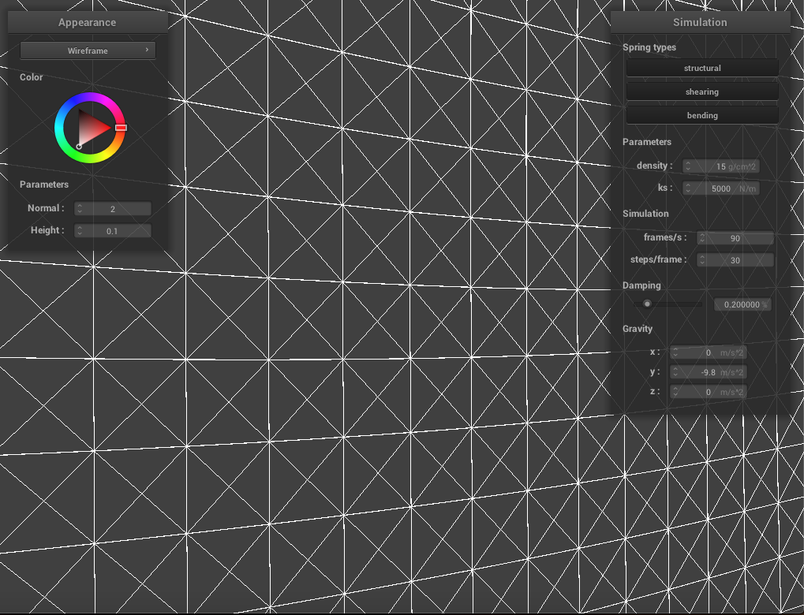
          <figcaption align="middle">pinned2.json - closeup</figcaption>
      </td>
      <td align="middle">
          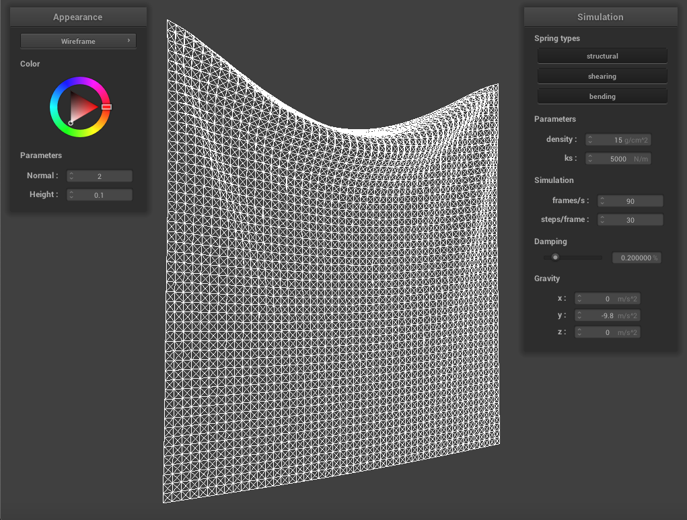
          <figcaption align="middle">pinned2.json - full view</figcaption>
      </td>
  </table>

 Here's what the constraints look like: 

  <table style="width=100%">
     <tr>
      <td align="middle">
          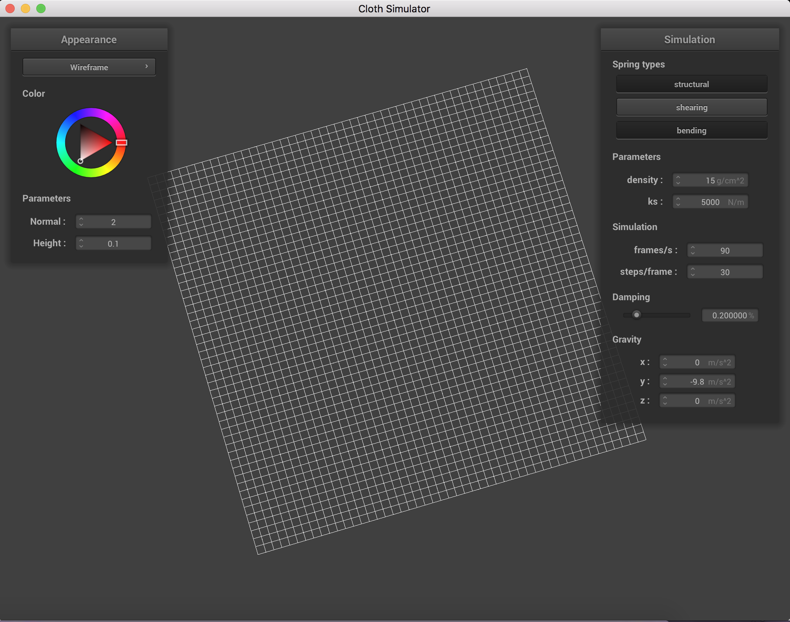
          <figcaption align="middle">pinned2.json - no shearing constraints</figcaption>
      </td>
      <td align="middle">
          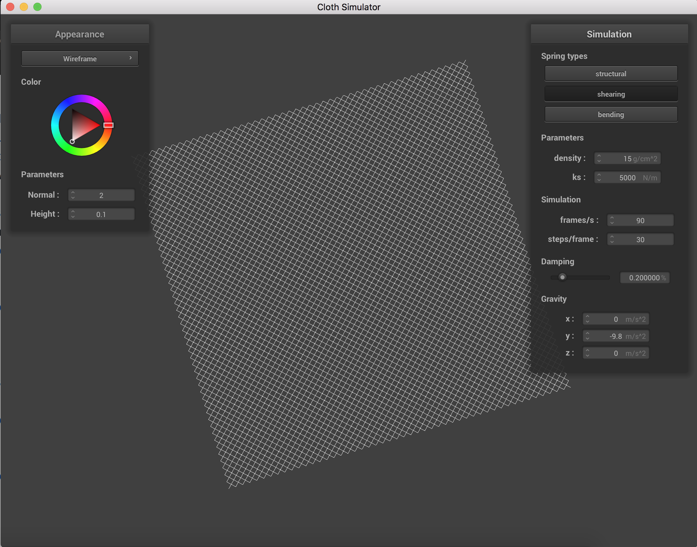
          <figcaption align="middle">pinned2.json - only shearing constraints</figcaption>
      </td>
     </tr>
     <tr>
      <td align="middle">
          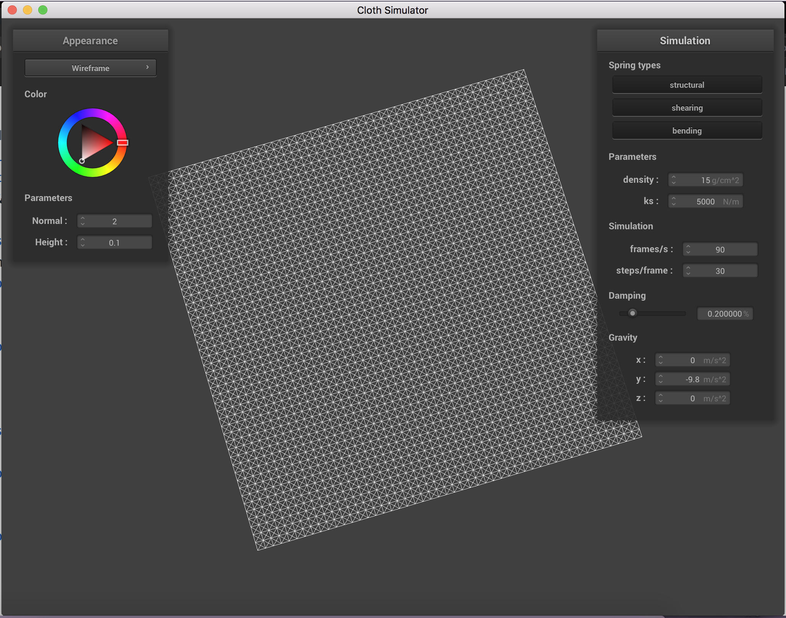
          <figcaption align="middle">pinned2.json - all constraints</figcaption>
      </td>
     </tr>
  </table>

As you can see in the images above, the shearing constraints appear as connecting
diagonal elements. Structural and bending constraints appear as a grid because they
connect adjacent (non-diagonal) elements.

<h2 align="middle">Part II: Simulation via numerical integration</h2>

In part 2, we first began by computing the total force acting on each point mass
by incorporating external accelerationd and Hooke's Law. We then compute the change
in positions using Verlet integration, ultimately implementing the equation

 

  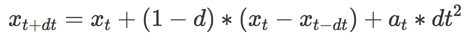

 

Finally, we add constraints, noting that a spring length can't be 10% greater than
its rest length. Throughout the whole process, we take into account whether a point
is pinned, at which point we make no modifications to the position of the point.

  <table style="width=100%">
     <tr>
      <td align="middle">
          
          <figcaption align="middle">density 1</figcaption>
      </td>
      <td align="middle">
          
          <figcaption align="middle">density 1000</figcaption>
      </td>
     </tr>
     <tr>
      <td align="middle">
          
          <figcaption align="middle">k = 1</figcaption>
      </td>
      <td align="middle">
          
          <figcaption align="middle">k = 100000</figcaption>
      </td>
     </tr>
     <tr>
      <td align="middle">
          
          <figcaption align="middle">high damping</figcaption>
      </td>
      <td align="middle">
          
          <figcaption align="middle">low damping</figcaption>
      </td>
     </tr>
  </table>

Higher <code>ks</code> give a much stiffer cloth and falls with less movement, whereas
low <code>ks</code> makes a lot of free flowing wiggling as it falls. High density makes
the cloth much ehavier and solid, so that whne it falls doesn't have many wrinkles or folds.
At the same time, it seems pretty flexible because when it falls onto the sphere, it's
completely smooth. In contrast, low density makes the cloth light and wrinkly, but also
somewhat stiff as it doesn't wrap itself smoothly around the sphere. With high damping,
the cloth falls very slowly and immediately settles into its resting position. With low
damping, the cloth falls very quickly and bounces a lot until it settles.

  
  <figcaption align="middle">final resting state</figcaption>

<h2 align="middle">Part III: Handling collisions with other objects </h2>

In this part, we handled collisions of cloth with a sphere and with a plane. For the
sphere collision, we computed the tangent point of the surface intersection as well as a
correciton vector to apply to the point mass in order to bring it to the tangent point.
We do roughly the same thing for the plane. 

  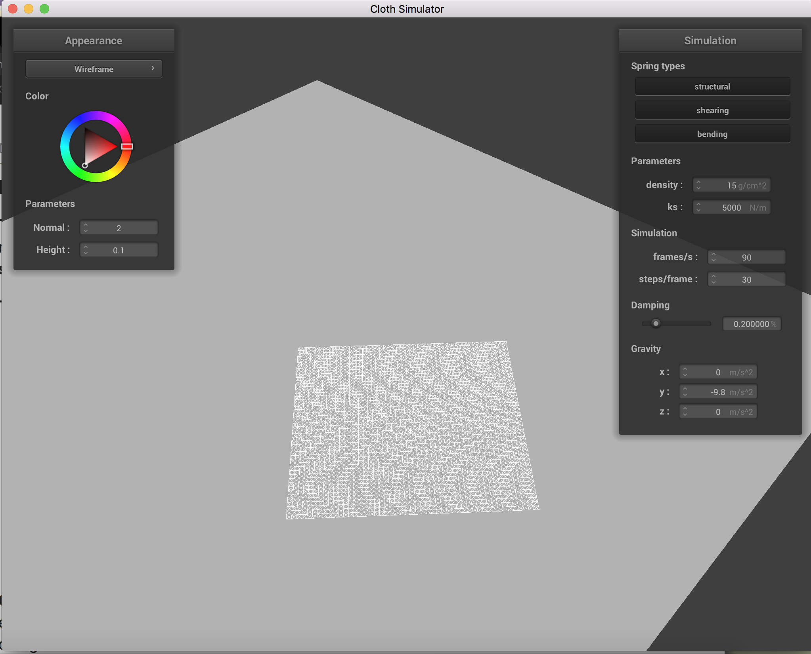
  <figcaption align="middle">Flat on plane</figcaption>

 
As you can see in the sphere image, as the
spring constant increases from 500 to 50000, the fabric appears to get more and more stiff. 
This is because springs with a higher spring constant are stiffer. You can imagine this
as the difference between silk and denim.
 

  <table style="width=100%">
 
     <tr>
      <td align="middle">
          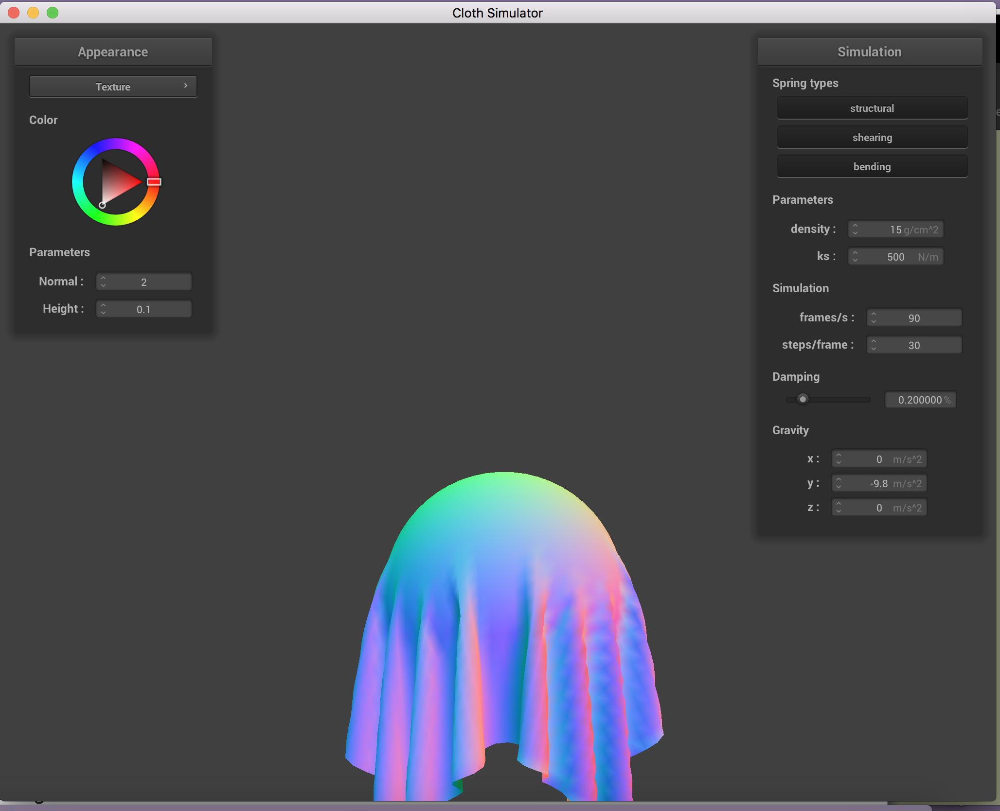
          <figcaption align="middle">sphere.json - 500 ks </figcaption>
      </td>
      <td align="middle">
          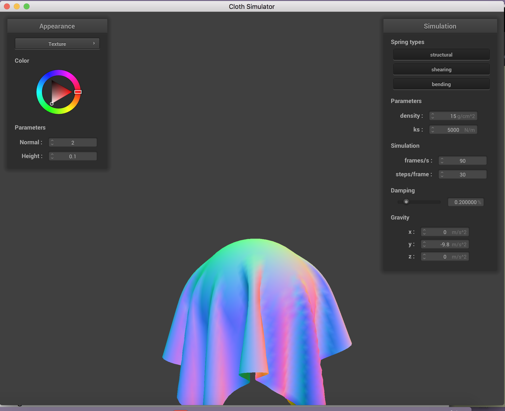
          <figcaption align="middle">sphere.json - 5,000 ks (default)</figcaption>
      </td>
     </tr>
     <tr>
      <td align="middle">
          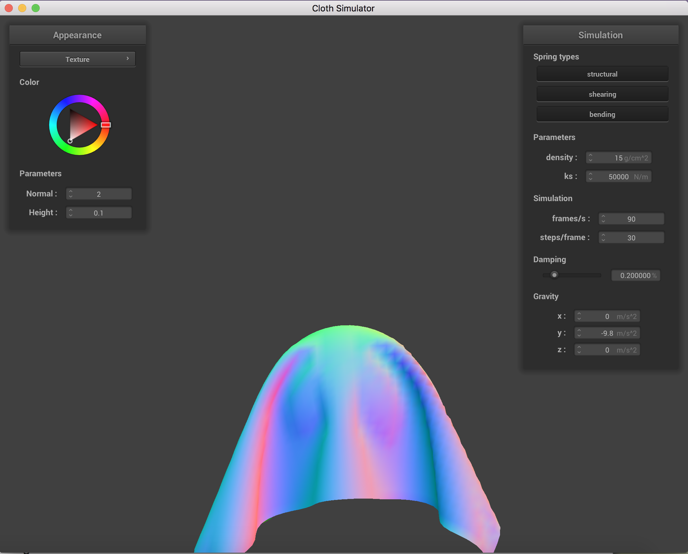
          <figcaption align="middle">sphere.json - 50,000 ks</figcaption>
      </td>
     </tr>
  </table>

<h2 align="middle">Part IV: Handling self-collisions </h2>

In this section, we implemented self-collisions. First, we computed a hash
to partition the point masses into a 3D box with dimensions <code> w * h * t 
= 3 * width / num_width_points x 3 * height / num_height_points x max(w, h)
</code>. We then do a simple division between the x, y, and z coordinates
with w, h, and t, respectively, and floor the result to bin the point masses.
Then, we construct our spatial map and use that in our <code> Cloth::self_collide() </code> 
function. This way, we don't have to iterate through the entire grid every
time we want to test a candidate point mass. Using the point masses in map
at a computed hash, we then check whether the distance between a point mass
and its candidate point masses are within <code> 2*thickness </code> and 
if so, compute a correction vector to offset the point mass such that it
is no longer too close to the candidate.

  Unfortunately, we were not able to get this part completely working.
Here is a screenshot of it as is:

  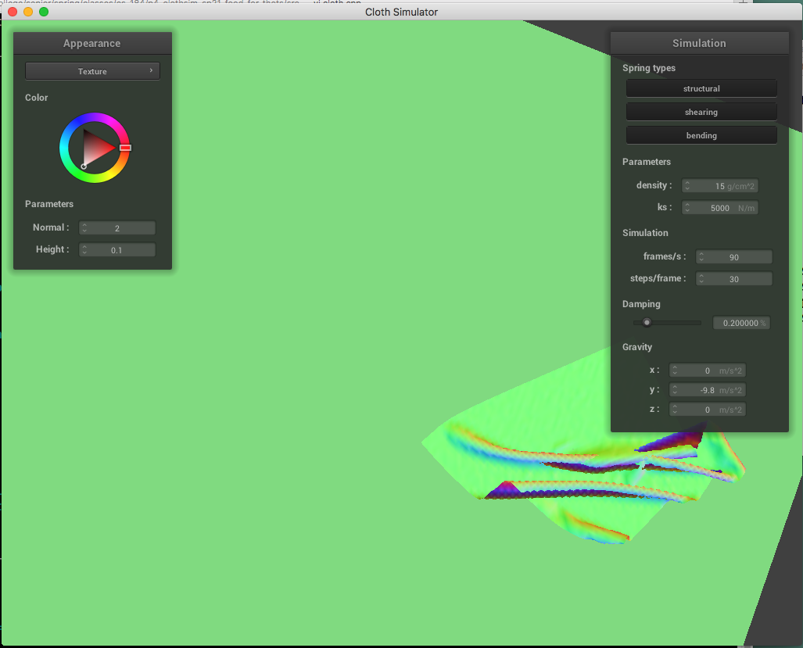
  <figcaption align="middle">Part 4 as is</figcaption>

Varying the density would have the effect of making the fabric thinner,
causing it to fold over more. As in the other parts, increasing the 
spring constant makes the fabric stiffer and less flexible when it 
folds on itself, causing it to be more rigid.

<h2 align="middle">Part V: Shaders </h2>
<h3 align="middle">Background</h3>

Shaders are programs that can run individually and can compute information
that helps render lighting, color, etc. Vertex shaders modify geometic properties
of vertices, which are then passed into fragment shaders to help compute color.
Blinn-Phong shading expands upon the Lambertian shading model and incorporates
viewer angle and specular lighting to create a more accurate lighting model.

<h3 align="middle">Implementation</h3>

In this part, we added shading and texture to the cloth. We first started by
incorporating <b>diffuse lighting</b>, following the formula:

  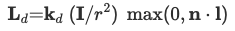

We then moved onto the <b>Blinn-Phong</b> shading model, following the formula:

  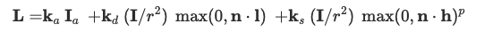

  <table style="width=100%">
     <tr>
      <td align="middle">
          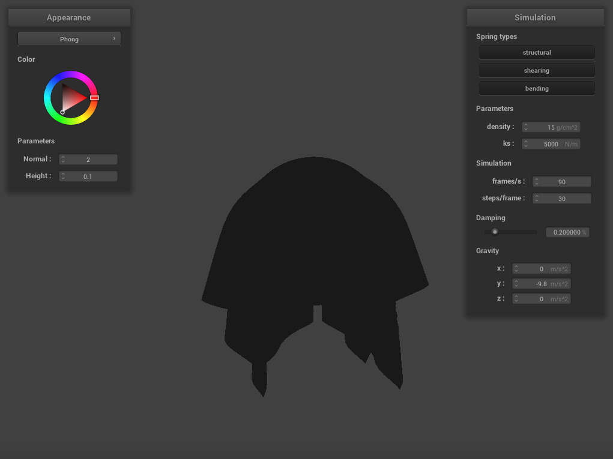
          <figcaption align="middle">Blinn-Phong ambient component</figcaption>
      </td>
      <td align="middle">
          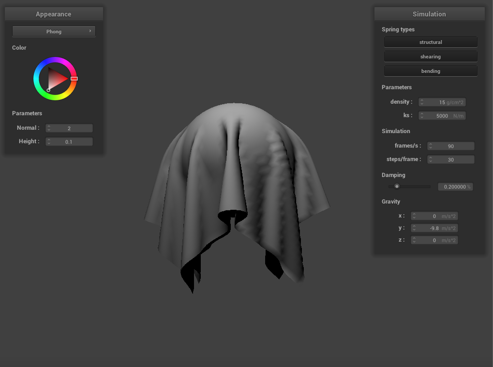
          <figcaption align="middle">Blinn-Phong diffuse component</figcaption>
      </td>
     </tr>
     <tr>
      <td align="middle">
          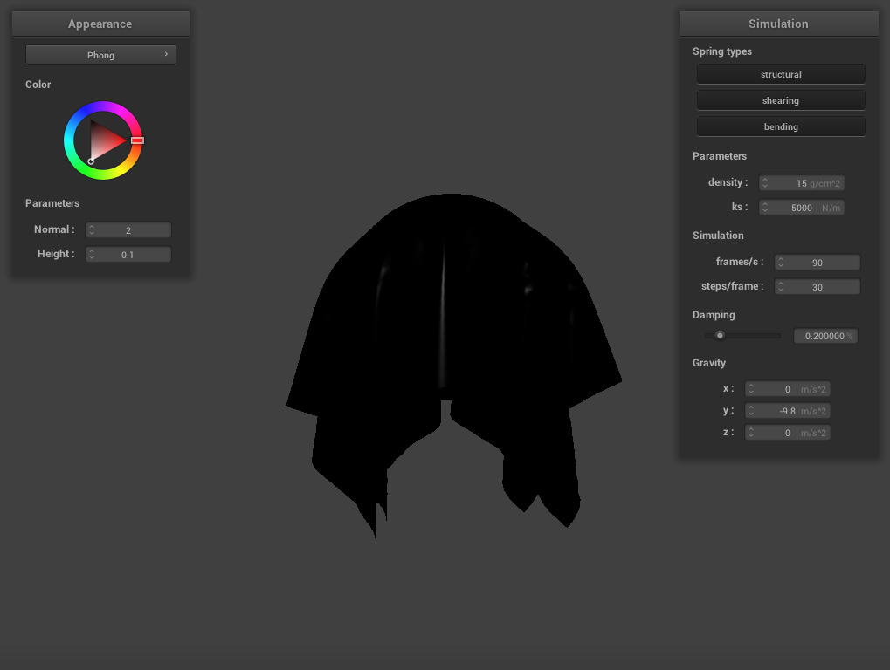
          <figcaption align="middle">Blinn-Phong specular component</figcaption>
      </td>
     </tr>
  </table>

For the next section, we simply called the built-in texture method to add
a texture's color to our cloth.

  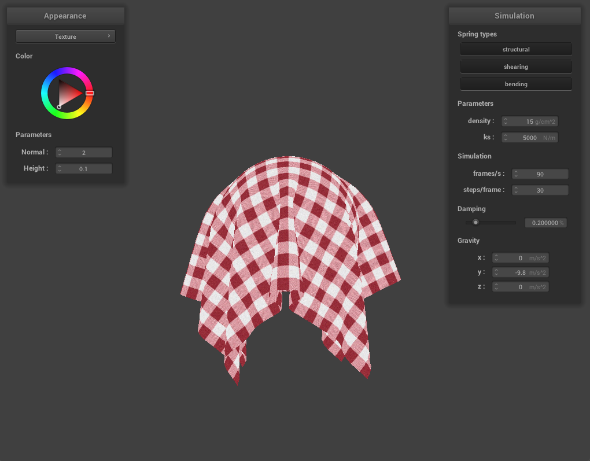
  <figcaption align="middle">Custom texture</figcaption>

<!-- compare the two approaches: -->
Here are the screenshots of bump mapping on the cloth and the sphere.

  <table style="width=100%">
     <tr>
      <td align="middle">
          
          <figcaption align="middle">Bump mapping on sphere</figcaption>
      </td>
      <td align="middle">
          
          <figcaption align="middle">Bump mapping on cloth</figcaption>
      </td>
     </tr>
  </table>

  <table style="width=100%">
     <tr>
      <td align="middle">
          
          <figcaption align="middle">Displacement mapping on sphere</figcaption>
      </td>
      <td align="middle">
          
          <figcaption align="middle">Displacement mapping on cloth</figcaption>
      </td>
     </tr>
  </table>

  <table style="width=100%">
     <tr>
      <td align="middle">
          
          <figcaption align="middle">Low contrast</figcaption>
      </td>
      <td align="middle">
          
          <figcaption align="middle">High contrast</figcaption>
      </td>
     </tr>
     <tr>
      <td align="middle">
          
          <figcaption align="middle">coarseness = 16</figcaption>
      </td>
      <td align="middle">
          
          <figcaption align="middle">coarseness = 128</figcaption>
      </td>
     </tr>
  </table>

Here are screenshots of the mirror on the sphere and on the cloth.

  <table style="width=100%">
  <tr>
  <td>
    
    <figcaption align="middle">Mirror on cloth</figcaption>
  </td>
  <td>
    
    <figcaption align="middle">Mirror on sphere</figcaption>
  </td>
  </tr>
  </table>

For 5.4, we adjusted our normal vectors by first computing our local space normals with 

  

 then taking those normals and multiplying it with the TBN matrix to find our displaced model space normal. Using this normal in our color calculations gives our items the illusion of textured material. In 5.5, we expanded upon this texture by recalculating some of the positions within our vertices using 

  

Updating our positions then gives our materials not only makes the lighting look like its textured, but also physically changes our cloth so that its position is displaced and giving it an actual physical texture. All in all, bump texture looks like it has texture, but the cloth shape is still smooth, whereas displacement texture has both textured lighting and the physical cloth itself has changed positions and texture. When coarseness is changed, it’s very hard to see anything different zoomed out. When zoomed in, the 128 coarseness is just slightly more high contrast and textured than the 16 coarseness sphere. 
 
Finally, for part 5.5, we simply reflected the outgoing eye-ray across our surface normal to generate the mirrored effect, using the texture that we sampled from the environment map. 
 
Shaders are programs that can run individually and can compute information that helps render lighting, color, etc. Vertex shaders modify geometric properties of vertices, which are then passed into fragment shaders to help compute color. Blinn-Phong shading expands upon the Lambertian shading model and incorporates viewer angle and specular lighting to create a more accurate lighting model.

<h2 align="middle">Addendum: Working together </h2>

Overall, working on this project was no different than the others. We find that
allowing one person to write the first pass of the code and having the other
person help debug it is a good way to do it. This way, each person gets the space
to do their own thinking without the pressure of another person waiting on them.
By the time the structure of the code is written, its easier to attack it together
and make the slight modifications like changing formulas. Unfortunately, we both
have a bad case of senioritis which is why we're turning the project in two days late.

</body>
</html>
